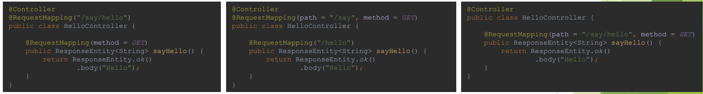
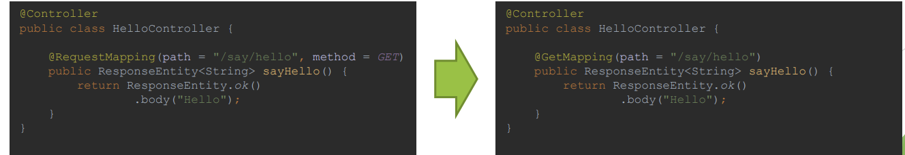
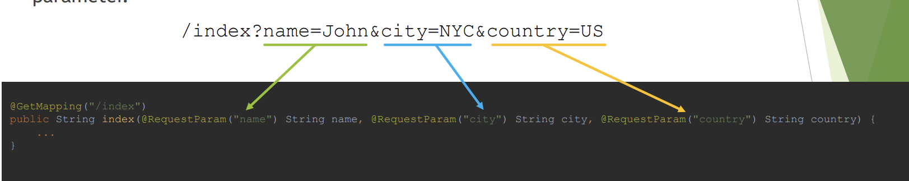
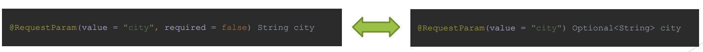
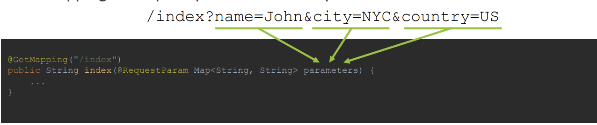
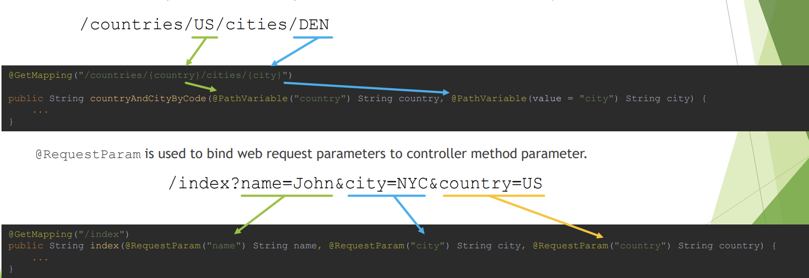

Spring MVC
----------

MVC - design pattern
-------
1. MVC stands for Model-View-Controller, it is a design pattern which divides application into three main interconnected component types.
    
   
2. Spring MVC introduces ready to use components that you can use in your application for MVC pattern.
    
3. Usage of MVC design pattern has following advantages:
   1. Separation of concerns
   2. Increased code cohesion
   3. Increased code reusability
   4. Reduces coupling between data, logic and information representation
   5. Lowers maintenances costs
   6. Increases extendibility
4. [Source Code](MVCPattern)

DispatcherServlet
---------------
1. DispatcherServlet is an internal Spring MVC component that implements
   HttpServlet from Java Servlet API and Front Controller Design Pattern. It is used
   to handle all requests to the application, based on servlet mapping, delegate
   those requests to controllers and produce response based on identified view.
2. DispatcherServlet has following responsibilities:
   1. Delegates received requests to Controllers
   2. Uses View Resolvers to resolve views pointed out by Controllers
   3. Produces Response that is sent to use
   4. Handles shared concerns, like exception mapping, error handling, security
      etc

Front Controller Design Pattern
-----------------------------
1. Front Controller Design Pattern allows you to implement shared algorithm for
   entire application responsible for request processing and handling shared
   concerns.
    

Java Servlet API
----------------
1. Servlet is a Java Technology used to create Web Applications on Java Platform with usage
of Application Servers. It is a set of interfaces, classes and documentation allowing you to
extend capabilities of Application Servers. Servlet is protocol independent, however usually
it is used to process HTTP Requests with usage of custom implementation of HttpServlet
class. Servlet can be registered via web.xml, or programmatically via annotations since
Servlet 3. Servlet registration requires url-patterns which informs application server which
requests should be mapped to your servlet
   

Examples
----------
1. Implementing MVC , front controller and Dispatcher Servlet on own
   1. [Source Code](MVCInAction)
2. Using Spring MVC libraries
   1. [Source Code](SpringMVCServlet)


web application context - Scopes
------------------------------------
1. Web Application Context is a Spring Application Context for Web Applications that
   runs under Embedded or Standalone Application Server that supports Servlet API
   and acts as Servlet Container
2. Web Application Context is described by WebApplicationContext interface
   and it allows you to access ServletContext interface from Servlet API.
3. Web Application Context provides four additional scopes:
   1. Request Scope
      1. Defined by `@RequestScope` annotation
      2. Bean lifecycle is tightly coupled with HTTP Request lifecycle
      3. New Bean instance is created for each request
      ```java
      @RequestScope
      @Component
      public class RequestScopeBean {
      }
         ```
   2. Session Scope
      1. Defined by `@SessionScope` annotation
      2. Bean lifecycle is tightly coupled with HTTP Session lifecycle
      3. New Bean is created for each new session and Bean instance lives as long as HTTP
         Session is alive
      ```java
      @SessionScope
      @Component
      public class SessionScopeBean {
      }
        ```
   3. Application Scope
      1. Defined by `@ApplicationScope` annotation
      2. Bean lifecycle is tightly coupled with ServletContext
      3. One Bean instance available per entire Web Application – ServletContext
      4. Differences compared to Singleton Bean:
         1. Singleton per ServletContext, not per Spring Application Context (one Web Application
            may have several Spring Application Contexts)
         2.  Exposed via attribute of ServletContext
      ```java
      @ApplicationScope
      @Component
      public class ApplicationScopeBean {
      }
       ``` 
   4. Websocket Scope
      1. Defined by @Scope annotation with specified properties:
         1. `@Scope(scopeName = "websocket", proxyMode = ScopedProxyMode.TARGET_CLASS)`
      2. Bean lifecycle is coupled with lifecycle of WebSocket Session, however bean usually lives
         longer then WebSocket Session.
      ```java
      @Scope(scopeName = "websocket", proxyMode = ScopedProxyMode.TARGET_CLASS)
      @Component
      public class WebSocketScopeBean {
      }
      ```
   5. [Source Code](WebApplicationScopes)

@Controller
-------
1. @Controller annotation is used to indicate that annotated class is a Controller from
   Model-View-Controller Design Pattern, and should be considered a candidate for request
   handling when DispatcherServlet searches for component to which work can be
   delegated.
2. @Controller annotation is a specialization of @Component annotation, this allows
   Spring to autodetect controllers during classpath scanning.
3. Controllers in Spring do not have to implement any interface or extend any base class,
   Spring uses annotation-based programming model with @Controller annotation being
   part of it. Controllers have flexible methods signatures with mapping expressed via
   annotations like @RequestMapping, @GetMapping, @PostMapping etc.
   ```java
   @Controller
   public class HelloController {
   }

    ```

How is an incoming request mapped to a controller and mapped to a method
----------------------
1. Incoming request is mapped to a controller and a method by DispatcherServlet,
   which uses `HandlerMapping` and `HandlerAdapter` components for this purpose.
2. HandlerMapping components are used during Spring initialization to scan classpath
   for @Controller or @RestController classes with one of request mapping
   annotations that are part of annotation based programming model:
   1. @RequestMapping
   2. @GetMapping
   3. @PostMapping
   4. @PutMapping
   5. @PatchMapping
   6. @DeleteMapping
3. HandlerAdapter components are responsible for execution of method identified as
   handler candidate for the request.
4. When request is performed against the server following steps are executed:
   1. Application Server (Standalone or Embedded) searches for Servlet that can
      handle request, DispatcherServlet is selected based on Servlet
      Registration and url-pattern.
   2. DispatcherServlet uses HandlerMapping classes to get request mapping
      information and HandlerAdapter
   3. DispatcherServlet uses HandlerAdapter to execute controller method
      that will handle request.
   4. DispatcherServlet interprets results of method execution and renders
      View with help of ViewResolver classes.
   5. @RequestMapping allows you to specify conditions that request has to match
      for a method to be used as request handler. @RequestMapping can be used at
      class or method level, when used at the class level, all method level mappings
      inherit this primary mapping, narrowing it to a specific handler method.
   6. For example, below controllers are supposed to map GET /say/hello
      requests, even though request mapping is defined differently, all are equal.
      
   7. @RequestMapping annotation allows you to specify following criteria for request:
      1. path - uri path/paths for request, for example /api/books
      2. method – supported HTTP method/methods: GET, POST, HEAD, OPTIONS, PUT,
         PATCH, DELETE, TRACE
      3. params – required parameters of request, for example key1=value1,
         key2!=value2, key1, !key1
      4. headers – header needs to match specified condition, for example header1=value1,
         header2!=value2, header1, !header1, content-type=text/*
      5. consumes – media types that can be consumed by request, for example
         application/json
      6. produces – media types that are produced by method handling the request, for
         example application/pdf

   8. Spring MVC also supports composed annotations for request mapping:
      1. @GetMapping
      2. @PostMapping
      3. @PutMapping
      4. @PatchMapping
      5. @DeleteMapping
   9. Each of those annotations allows you to specify same conditions as @RequestMapping
      except for HTTP method field, following fields in @*Mapping are aliases to
      @RequestMapping: path, params, headers, consumes, produces.
   10. In most of the cases it is possible to translate mappings between those annotations, one
       example when this is not possible is when creating HTTP HEAD request mapping
       
   11. [Source Code](RequestMappings)


@RequestMapping vs @GetMapping
-------------
1. The main difference between @RequestMapping and @GetMapping is that first one can be
   used to map any HTTP method requests and second one can be used to map only HTTP GET
   method requests. @GetMapping is less flexible, but easier to use.
2. @GetMapping annotation is a composed annotation that is equal to
   @RequestMapping(method = RequestMethod.GET).
   Both annotations allows you to specify multiple criteria for request mapping, like uri path,
   required headers, consumable media types, producible media types, however only
   @RequestMapping allows you to specify HTTP method or HTTP methods through method field.
   If none HTTP methods are specified, all HTTP methods will be mapped.
3. Spring also includes other specialized versions of @RequestMapping:
   1. @PostMapping
   2. @PutMapping
   3. @DeleteMapping
   4. @PatchMapping
4. Usage of those simpler, specialized versions is recommended for simple HTTP method mappings.


@RequestParam
----------
1. @RequestParam is used to bind web request parameters to controller method
   parameter.
   
2. Because Servlet API combines query parameters and form data into a single
   parameters map, it is possible to use @RequestParam annotation to map:
   1. query parameters
   2. form data
   3. parts in multipart requests
3. @RequestParam allows you to specify following parameters:
   1. name – the name of request parameter to bind
   2. required - whether the parameter is required or not
      1. by default parameter is required and in case of it being absent exception will be
         thrown
      2. If switched to false, in case of parameter being absent null value will be provided
         or value pointed out by defaultValue property
   3. defaultValue – allows you to specify default value to use in case of absence
      of optional parameter
   4. @RequestParam annotation also supports Java 8 Optional, so following will
      be equal:
      
   5. @RequestParam also supports additional use cases, like:
      1. Mapping all request parameters to Map
         
      2. Mapping all values to List
         
   6. Example
      ```java
      @Controller
      public class IndexController {

        // curl localhost:8080/actionA?name=John
        // curl localhost:8080/actionA
        @GetMapping("/actionA")
        @ResponseBody
        public String actionA(@RequestParam("name") String name) {
            return String.format("Retrieved name = [%s]\n", name);
        }

        // curl "localhost:8080/actionB?name=John&city=NYC"
        // curl localhost:8080/actionB?name=John
        @GetMapping("/actionB")
        @ResponseBody
        public String actionB(@RequestParam("name") String name, @RequestParam(value = "city", required =     false) String city) {
            return String.format("Retrieved name = [%s], city = [%s]\n", name, city);
        }

        // curl "localhost:8080/actionC?name=John&city=NYC"
        // curl localhost:8080/actionC?name=John
        @GetMapping("/actionC")
        @ResponseBody
        public String actionC(@RequestParam("name") String name, @RequestParam(value = "city", required =     false, defaultValue = "N/A") String city) {
            return String.format("Retrieved name = [%s], city = [%s]\n", name, city);
        }

        // curl "localhost:8080/actionD?name=John&city=NYC"
        // curl localhost:8080/actionD?name=John
        @GetMapping("/actionD")
        @ResponseBody
        public String actionD(@RequestParam("name") String name, @RequestParam(value = "city")     Optional<String> city) {
            return String.format("Retrieved name = [%s], city = [%s]\n", name, city.orElse("N/A"));
        }

        // curl "localhost:8080/actionE?name=John&city=NYC&country=US"
        @GetMapping("/actionE")
        @ResponseBody
        public String actionE(@RequestParam Map<String, String> parameters) {
            String parametersAsString = parameters.entrySet().stream()
                .map(entry -> String.format("[%s] -> [%s]", entry.getKey(), entry.getValue()))
                .collect(Collectors.joining(", "));

            return String.format("Retrieved parameters map = [%s]\n", parametersAsString);
        }

        // curl "localhost:8080/actionF?cities=1,2,3"
        @GetMapping("/actionF")
        @ResponseBody
        public String actionF(@RequestParam("cities") List<String> cities) {
            return String.format("Retrieved cities identifiers = [%s]\n", String.join(", ", cities));
        }

        // curl "localhost:8080/actionG?name=John&city=NYC&country=US"
        @GetMapping("/actionG")
        @ResponseBody
        public String actionG(@RequestParam("name") String name, @RequestParam("city") String city,     @RequestParam("country") String country) {
            return String.format("Retrieved name = [%s], city = [%s], country = [%s]\n", name, city,     country);
        }
       }
      ```

@PathVariable
---------
1. The main difference between @RequestParam and @PathVariable is a purpose of each annotation.
2. @PathVariable is responsible for mapping parts of URI, marked with usage of URI templates variables
   to controller method parameters. URI templates are identifiers surrounded with curly brackets.
   
3. The other difference between @RequestParam and @PathVariable is following:
   1. @RequestParam allows you to specify defaultValue property, @PathVariable
      does not
4. Similarities are following, both allows you to:
      1. Specify name of variable to bind
      2. Mark variables as required or optional
      3. Use Java 8 Optional for optional values
      4. Map all parameters to Map
      5. Map list of values for parameter to collection
5. Example
   ```java
       @Controller
       public class IndexController {
    
        // curl localhost:8080/actionA/cities/ORD
        // curl localhost:8080/actionA/cities/LAX
        @GetMapping("/actionA/cities/{city}")
        @ResponseBody
        public String cityByCode(@PathVariable("city") String city) {
            return String.format("Retrieved city = [%s]\n", city);
        }
    
        // curl localhost:8080/actionB/countries/US/cities/DEN
        // curl localhost:8080/actionB/countries/PL/cities/KRK
        @GetMapping("/actionB/countries/{country}/cities/{city}")
        @ResponseBody
        public String countryAndCityByCode(@PathVariable("country") String country, @PathVariable(value = "city") String city) {
            return String.format("Retrieved country = [%s], city = [%s]\n", country, city);
        }
    
        // curl localhost:8080/actionC/countries/US/cities/DEN
        // curl localhost:8080/actionC/countries/US
        @GetMapping({"/actionC/countries/{country}/cities/{city}", "/actionC/countries/{country}"})
        @ResponseBody
        public String countryAndOptionalCityByCode(@PathVariable("country") String country, @PathVariable(value = "city", required = false) String city) {
            return String.format("Retrieved name = [%s], city = [%s]\n", country, city);
        }
    
        // curl localhost:8080/actionD/countries/US/cities/DEN
        // curl localhost:8080/actionD/countries/US
        @GetMapping({"/actionD/countries/{country}/cities/{city}", "/actionD/countries/{country}"})
        @ResponseBody
        public String countryAndOptionalCityByCodeJava8(@PathVariable("country") String country, @PathVariable(value = "city") Optional<String> city) {
            return String.format("Retrieved name = [%s], city = [%s]\n", country, city.orElse("N/A"));
        }
    
        // curl localhost:8080/actionE/countries/US/cities/DFW/zip/75038
        @GetMapping("/actionE/countries/{country}/cities/{city}/zip/{code}")
        @ResponseBody
        public String actionE(@PathVariable Map<String, String> parameters) {
            String parametersAsString = parameters.entrySet().stream()
                    .map(entry -> String.format("[%s] -> [%s]", entry.getKey(), entry.getValue()))
                    .collect(Collectors.joining(", "));
    
            return String.format("Retrieved parameters map = [%s]\n", parametersAsString);
        }
    
        // curl localhost:8080/actionF/countries/US,PL,UK
        @GetMapping("/actionF/countries/{countries}")
        @ResponseBody
        public String actionF(@PathVariable("countries") List<String> countries) {
            return String.format("Retrieved cities identifiers = [%s]\n", String.join(", ", countries));
        }
       }
    ```
