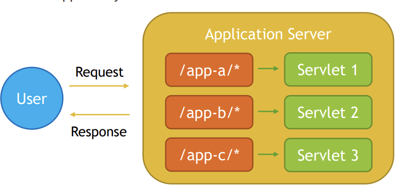

Spring MVC
----------

MVC - design pattern
-------
1. MVC stands for Model-View-Controller, it is a design pattern which divides application into three main interconnected component types.
    
   
2. Spring MVC introduces ready to use components that you can use in your application for MVC pattern.
    
3. Usage of MVC design pattern has following advantages:
   1. Separation of concerns
   2. Increased code cohesion
   3. Increased code reusability
   4. Reduces coupling between data, logic and information representation
   5. Lowers maintenances costs
   6. Increases extendibility
4. [Source Code](MVCPattern)

DispatcherServlet
---------------
1. DispatcherServlet is an internal Spring MVC component that implements
   HttpServlet from Java Servlet API and Front Controller Design Pattern. It is used
   to handle all requests to the application, based on servlet mapping, delegate
   those requests to controllers and produce response based on identified view.
2. DispatcherServlet has following responsibilities:
   1. Delegates received requests to Controllers
   2. Uses View Resolvers to resolve views pointed out by Controllers
   3. Produces Response that is sent to use
   4. Handles shared concerns, like exception mapping, error handling, security
      etc

Front Controller Design Pattern
-----------------------------
1. Front Controller Design Pattern allows you to implement shared algorithm for
   entire application responsible for request processing and handling shared
   concerns.
    

Java Servlet API
----------------
1. Servlet is a Java Technology used to create Web Applications on Java Platform with usage
of Application Servers. It is a set of interfaces, classes and documentation allowing you to
extend capabilities of Application Servers. Servlet is protocol independent, however usually
it is used to process HTTP Requests with usage of custom implementation of HttpServlet
class. Servlet can be registered via web.xml, or programmatically via annotations since
Servlet 3. Servlet registration requires url-patterns which informs application server which
requests should be mapped to your servlet
   
