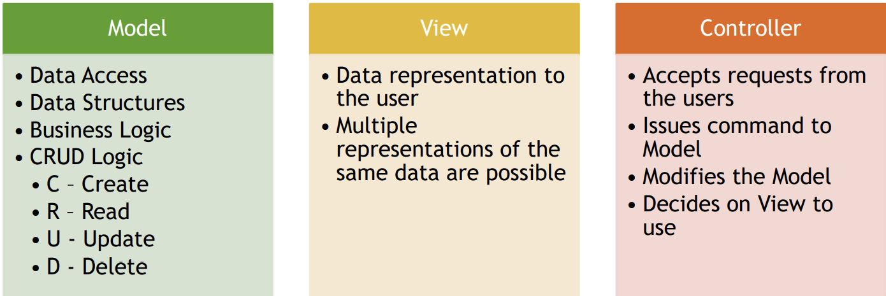

Spring MVC
----------

MVC - design pattern
-------
1. MVC stands for Model-View-Controller, it is a design pattern which divides application into three main interconnected component types.
    
   
2. Spring MVC introduces ready to use components that you can use in your application for MVC pattern.
    
3. Usage of MVC design pattern has following advantages:
   1. Separation of concerns
   2. Increased code cohesion
   3. Increased code reusability
   4. Reduces coupling between data, logic and information representation
   5. Lowers maintenances costs
   6. Increases extendibility
